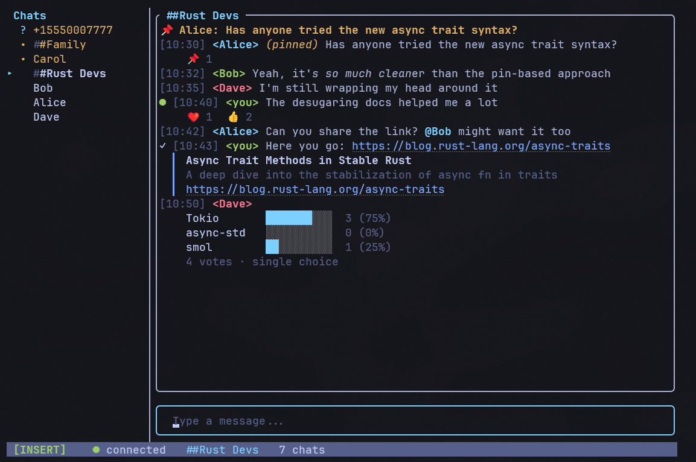

> This is the French translation of the siggy README.
> Last updated against English commit: 7a8d221
> The [English version](README.md) is authoritative. If this translation has drifted, trust the English.

<p align="center">
  
</p>

<p align="center">
  <a href="https://github.com/johnsideserf/siggy/actions/workflows/ci.yml"></a>
  <a href="https://github.com/johnsideserf/siggy/releases/latest"></a>
  <a href="LICENSE"></a>
  <a href="https://crates.io/crates/siggy"></a>
  <a href="https://johnsideserf.github.io/siggy/"></a>
  <a href="https://ko-fi.com/johnsideserf"></a>
  <a href="https://x.com/siggyapp"></a>
</p>

<p align="center">
  <a href="README.md">English</a>
  &nbsp;|&nbsp;
  <b>Français</b>
  &nbsp;|&nbsp;
  <a href="TRANSLATING.md">Proposez une traduction</a>
</p>

Un client de messagerie Signal pour terminal, dans un style IRC. Enveloppe [signal-cli](https://github.com/AsamK/signal-cli) via JSON-RPC pour le backend de messagerie.



## Installer

### Homebrew (macOS)

```sh
brew tap johnsideserf/siggy
brew install siggy
```

### Fichiers binaires précompilés

Téléchargez la dernière version pour votre plateforme depuis la page [Releases](https://github.com/johnsideserf/siggy/releases).

**Linux / macOS**:

```sh
curl -fsSL https://raw.githubusercontent.com/johnsideserf/siggy/master/install.sh | bash
```

**Windows** (PowerShell):

```powershell
irm https://raw.githubusercontent.com/johnsideserf/siggy/master/install.ps1 | iex
```

Ces deux scripts téléchargent la dernière version binaire et vérifient la présence de signal-cli.

### Source : crates.io

Nécessite Rust 1.70+.

```sh
cargo install siggy
```

### Compiler à partir du code source

Ou bien clonez le projet et compilez-le localement :

```sh
git clone https://github.com/johnsideserf/siggy.git
cd siggy
cargo build --release
# Le fichier binaire se trouve à target/release/siggy
```

## Conditions préalables

- [signal-cli](https://github.com/AsamK/signal-cli) doit être installé et accessible via le PATH (ou configuré via `signal_cli_path`)
- Un compte Signal associé en tant qu'appareil secondaire (l'assistant de configuration s'en charge)

## Utilisation

```sh
siggy                        # Lancer (utilise le fichier de configuration)
siggy -a +15551234567        # Spécifier un compte
siggy -c /path/to/config.toml  # Chemin vers la configuration personnalisée
siggy --setup                # Relancer l'assistant de configuration initiale
siggy --demo                 # Lancer avec des données factices (signal-cli non requis)
siggy --incognito            # Pas de stockage local des messages (uniquement en mémoire)
```

Lors du premier démarrage, l'assistant de configuration vous guide pour localiser signal-cli, saisir votre numéro de téléphone et connecter votre appareil via un code QR.

## Configuration

La configuration est chargée depuis :
- **Linux/macOS:** `~/.config/siggy/config.toml`
- **Windows:** `%APPDATA%\siggy\config.toml`

```toml
account = "+15551234567"
signal_cli_path = "signal-cli"
download_dir = "/home/user/signal-downloads"
notify_direct = true
notify_group = true
desktop_notifications = false
inline_images = true
mouse_enabled = true
send_read_receipts = true
theme = "Default"
proxy = ""
```

Tous les champs sont facultatifs. La valeur par défaut de `signal_cli_path` est `"signal-cli"` (recherché via le PATH), et celle de `download_dir` est `~/signal-downloads/`. Sous Windows, indiquez le chemin d'accès complet vers `signal-cli.bat` s'il ne figure pas dans votre PATH.

## Caractéristiques

- **Messagerie** -- Envoi et réception de messages privés et de groupe
- **Pièces jointes** -- Aperçus des images affichés en ligne sous forme de demi-blocs ; les pièces jointes autres que des images s'affichent sous la forme `[attachment: nom_fichier]`
- **Liens cliquables** -- Les URL et les chemins d'accès aux fichiers sont des hyperliens OSC 8 (cliquables dans des terminaux tels que Windows Terminal, iTerm2, etc.)
- **Indicateurs de saisie** -- Affiche qui est en train de taper, avec identification du nom du contact
- **Synchronisation des messages** -- Les messages envoyés depuis votre téléphone apparaissent dans le TUI
- **Persistance** -- Stockage des messages via SQLite en mode WAL ; les conversations et les marqueurs de lecture sont conservés après un redémarrage
- **Suivi des messages non lus** -- Nombre de messages non lus affiché dans la barre latérale, avec un séparateur « nouveaux messages » dans la fenêtre de discussion
- **Notifications** -- Signal sonore du terminal pour les nouveaux messages (paramétrable par conversation individuelle/de groupe, possibilité de désactiver les notifications pour certaines conversations) et notifications sur le bureau au niveau du système d'exploitation
- **Gestion des contacts** -- Noms issus de votre carnet d'adresses Signal ; groupes renseignés automatiquement au démarrage
- **Réactions aux messages** -- Réagissez avec la touche `r` en mode Normal ; sélecteur d'émojis avec affichage des badges (`👍 2 ❤️ 1`)
- **Répondre / citer** -- Appuyez sur la touche `q` sur un message sélectionné pour répondre en citant le contexte
- **Modifier les messages** -- Appuyez sur `e` pour modifier vos propres messages envoyés
- **Supprimer des messages** -- Appuyez sur `d` pour supprimer localement ou à distance (vos propres messages)
- **Recherche de messages** -- `/search <requête>` avec `n`/`N` pour passer d'un résultat à l'autre
- **@mentions** -- Tapez `@` dans les discussions de groupe pour mentionner des membres grâce à l'autocomplétion
- **Sélection de messages** -- Mise en surbrillance du message sélectionné lors du défilement ; utilisez les touches `J`/`K` pour passer d'un message à l'autre
- **Accusés de réception** -- Icônes d'état sur les messages envoyés (En cours d'envoi → Envoyé → Remis → Lu → Consulté)
- **Messages éphémères** -- Respecte les délais d'expiration des messages éphémères de Signal ; configurable par conversation avec `/disappearing`
- **Gestion des groupes** -- Créer des groupes, ajouter/supprimer des membres, renommer, quitter un groupe via `/group`
- **Demandes de messages** -- Acceptez ou supprimez les messages provenant d'expéditeurs inconnus
- **Bloquer / débloquer** -- Bloquez des contacts ou des groupes avec `/block` et `/unblock`
- **Prise en charge de la souris** -- Cliquez sur les conversations dans la barre latérale, faites défiler les messages, cliquez pour positionner le curseur
- **Thèmes de couleurs** -- Thèmes sélectionnables via `/theme` ou `/settings`
- **Assistant de configuration** -- Guide de démarrage lors de la première utilisation avec association de l'appareil via un code QR
- **Raccourcis clavier Vim** -- Édition modale (Normal/Insert) avec déplacement complet du curseur
- **Autocomplétion des commandes** -- Overlay d'autocomplétion par tabulation pour les commandes slash
- **Overlay des paramètres** -- Activation/désactivation des notifications, de la barre latérale et des images intégrées depuis l'application
- **Mise en page responsive** -- Barre latérale redimensionnable qui se masque automatiquement sur les terminaux étroits (<60 colonnes)
- **Mode incognito** -- `--incognito` utilise le stockage en mémoire ; rien n'est conservé après la fermeture
- **Prise en charge des proxys** -- Configurez un proxy TLS Signal via le champ de configuration `proxy` pour une utilisation sur des réseaux restreints
- **Mode démo** -- Essayez l'interface utilisateur sans signal-cli (`--demo`)

## Commandes

| Commande | Alias | Description |
|---|---|---|
| `/join <nom>` | `/j` | Rejoindre une conversation par nom de contact, numéro ou groupe |
| `/part` | `/p` | Quitter la conversation en cours |
| `/attach` | `/a` | Ouvrir le navigateur de fichiers pour joindre un fichier |
| `/search <requête>` | `/s` | Rechercher des messages dans la conversation en cours (ou toutes les conversations) |
| `/sidebar` | `/sb` | Afficher/masquer la barre latérale |
| `/bell [type]` | `/notify` | Activer/désactiver les notifications (`direct`, `group` ou les deux) |
| `/mute [durée]` | | Activer/désactiver le mode silencieux pour la conversation en cours (par ex. `1h`, `8h`, `1d`, `1w`) |
| `/block` | | Bloquer le contact ou le groupe actuel |
| `/unblock` | | Débloquer le contact ou le groupe actuel |
| `/disappearing <dur>` | `/dm` | Définir la durée d'expiration des messages (`off`, `30s`, `5m`, `1h`, `1d`, `1w`) |
| `/group` | `/g` | Ouvrir le menu de gestion des groupes |
| `/theme` | `/t` | Ouvrir le sélecteur de thème |
| `/contacts` | `/c` | Parcourir les contacts synchronisés |
| `/settings` | | Ouvrir l'overlay des paramètres |
| `/help` | `/h` | Afficher l'overlay d'aide |
| `/quit` | `/q` | Quitter siggy |

Tapez `/` pour ouvrir l'overlay d'autocomplétion. Utilisez la touche `Tab` pour valider, et les touches fléchées pour naviguer.

Pour envoyer un message à un nouveau contact : `/join +15551234567` (format E.164).

## Raccourcis clavier

L'application utilise un système d'édition modale de type Vim comprenant deux modes : **Insertion** (par défaut) et **Normal**.

### Raccourcis globaux (dans les deux modes)

| Touche | Action |
|---|---|
| `Ctrl+C` | Quitter |
| `Tab` / `Maj+Tab` | Conversation suivante / précédente |
| `Page précédente` / `Page suivante` | Faire défiler les messages (5 lignes) |
| `Ctrl+Gauche` / `Ctrl+Droite` | Redimensionner la barre latérale |

### Mode normal

Appuyez sur `Esc` pour passer en mode normal.

| Touche | Action |
|---|---|
| `j` / `k` | Défilement vers le bas / vers le haut d'une ligne |
| `J` / `K` | Aller au message précédent / suivant |
| `Ctrl+D` / `Ctrl+U` | Défilement vers le bas / vers le haut d'une demi-page |
| `g` / `G` | Défilement vers le haut / vers le bas |
| `h` / `l` | Déplacement du curseur vers la gauche / vers la droite |
| `w` / `b` | Avance / retour d'un mot |
| `0` / `$` | Début / fin de ligne |
| `x` | Suppression du caractère situé au niveau du curseur |
| `D` | Supprimer de la position du curseur jusqu'à la fin |
| `y` / `Y` | Copier le corps du message / la ligne entière |
| `r` | Réagir au message sélectionné |
| `q` | Répondre / citer le message sélectionné |
| `e` | Modifier son propre message envoyé |
| `d` | Supprimer le message (local ou distant) |
| `n` / `N` | Aller au résultat suivant / précédent de la recherche |
| `i` | Passer en mode insertion |
| `a` | Passer en mode insertion (curseur à droite de 1) |
| `I` / `A` | Passer en mode insertion au début / à la fin de la ligne |
| `o` | Passer en mode insertion (vider le tampon) |
| `/` | Passer en mode insertion avec `/` pré-saisi |

### Mode insertion (par défaut)

| Touche | Action |
|---|---|
| `Échap` | Passer en mode normal |
| `Entrée` | Envoyer un message / exécuter une commande |
| `Maj+Entrée` / `Alt+Entrée` | Insérer un saut de ligne (pour les messages sur plusieurs lignes) |
| `Backspace` / `Suppr` | Supprimer des caractères |
| `Flèche vers le haut` / `Flèche vers le bas` | Afficher l'historique de saisie |
| `Flèche vers la gauche` / `Flèche vers la droite` | Déplacer le curseur |
| `Début` / `Fin` | Aller au début / à la fin de la ligne |

## Architecture

```
Keyboard --> InputAction --> App state --> SignalClient (mpsc) --> signal-cli (JSON-RPC stdin/stdout)
signal-cli --> JsonRpcResponse --> SignalEvent (mpsc) --> App state --> SQLite + Ratatui render
```

```
+------------+   mpsc channels   +----------------+
|  TUI       | <---------------> |  Signal        |
|  (main     |   SignalEvent     |  Backend       |
|  thread)   |   UserCommand     |  (tokio task)  |
+------------+                   +--------+-------+
                                          |
                                   stdin/stdout
                                          |
                                 +--------v-------+
                                 |  signal-cli    |
                                 |  (child proc)  |
                                 +----------------+
```

Développé avec [Ratatui](https://ratatui.rs/) + [Crossterm](https://github.com/crossterm-rs/crossterm) sur le moteur d'exécution asynchrone [Tokio](https://tokio.rs/).

## License

[GPL-3.0](LICENSE)
