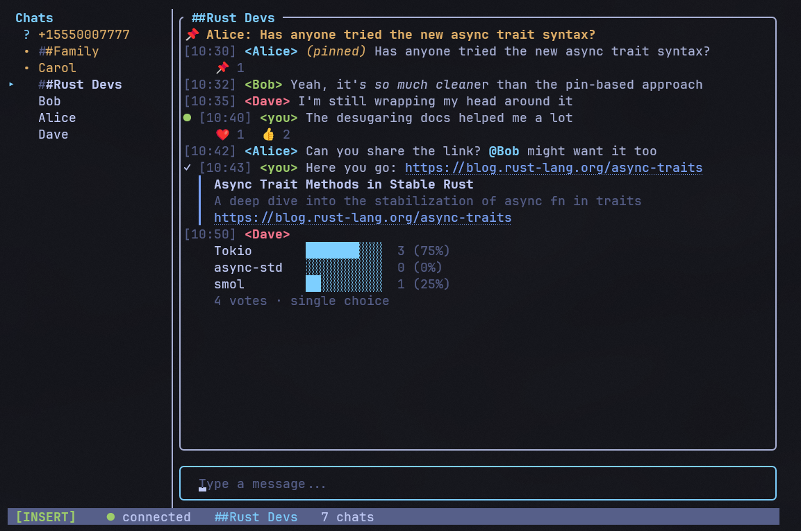

# signal-tui

A terminal-based Signal messenger client with an IRC aesthetic.



signal-tui wraps [signal-cli](https://github.com/AsamK/signal-cli) via JSON-RPC, giving you a
full-featured messaging interface that runs entirely in your terminal. Built with
[Ratatui](https://ratatui.rs/), [Crossterm](https://github.com/crossterm-rs/crossterm), and
[Tokio](https://tokio.rs/).

## Why signal-tui?

- **Lightweight** -- no Electron, no web browser, just your terminal
- **Vim keybindings** -- modal editing with Normal and Insert modes
- **Persistent** -- SQLite-backed message history that survives restarts
- **Private** -- incognito mode for ephemeral sessions with zero disk traces
- **Extensible** -- TOML configuration, slash commands, and a clean module architecture

## Quick start

**Linux / macOS:**

```sh
curl -fsSL https://raw.githubusercontent.com/johnsideserf/signal-tui/master/install.sh | bash
```

**Windows (PowerShell):**

```powershell
irm https://raw.githubusercontent.com/johnsideserf/signal-tui/master/install.ps1 | iex
```

**Then launch:**

```sh
signal-tui
```

The setup wizard will guide you through linking your Signal account on first launch.

## Try it without Signal

```sh
signal-tui --demo
```

Demo mode populates the UI with dummy conversations and messages so you can explore
the interface without a Signal account or signal-cli installed.

## License

[GPL-3.0](https://github.com/johnsideserf/signal-tui/blob/master/LICENSE)
